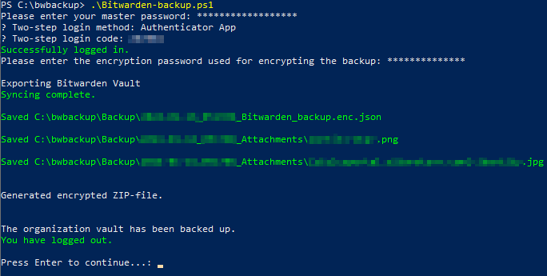

# Bitwarden Attachment Exporter
This PowerShell-script is a fork and extension of [justincswong/Bitwarden-Attachment-Exporter](https://github.com/justincswong/Bitwarden-Attachment-Exporter). Additional features include:
- Possibility to backup your organization vault by providing an organization ID.
- ZIP everything into a single, encrypted file (encrypted export + attachments) using [7-Zip](https://www.7-zip.org/).
- Cleaning up everything, so you end up with a single backup file containing everything.

This script provides a good balance between transparency (just read the `Bitwarden-backup.ps1`-file, it uses the standard Bitwarden-CLI), convenience (configure once, run and you will end up with a single backup-file) and completeness (it contains all items as well as the attachments).

## Requirements
- Install the official [Bitwarden CLI](https://github.com/bitwarden/cli) according to the instructions on the page.

Optional:  
- If you choose to use 7zip to encrypt the exports, you have to install [7-Zip](https://www.7-zip.org/) first.
- If you choose to use the GPG encryption feature, you must already have an implementation of GPG.

## How to use
- Install the prerequisites mentioned above.
- Download the `Bitwarden-backup.ps1`-file to a folder where your backup should be generated and open it in an editor of your choice.  
  - Change `<username>` to your Bitwarden username.
  - If you have an organization vault that you want to backup, change the `<organizationid>` to [the one used by your organization](https://bitwarden.com/help/cli/#organization-ids), else your personal vault will be backed up.
  - If you want to save everything (encrypted JSON + all attachments) into a single encrypted ZIP-file, `$sevenZip` should be `$true` (default) and been installed beforehand, of course.
  - If the files should be removed once zipped, set `deleteFilesAfterZIP` to `$true` (default).
  - Choose to enable GPG encryption or not. (It is not enabled by default)
  - If you enable GPG encryption, replace $keyname with the recipient. i.e. Your key's name or email address  
  - Choose to enable a secure deletion of your file or not. NOTE: If enabled, this process can take over 30 minutes (It is off by default)  
- Run the script (e. g. in a PowerShell-windows or by right clicking on the file and selecting `Run with PowerShell`).
- Your backup will begin and will be generated in the subfolder "Backup".
    1. The login procedure for Bitwarden will be initiated, asking you for your master password (for the account configured in the file) and eventually the TOTP for the two-step login.
    2. A password will be requested which will be used to encrypt the JSON-file downloaded as well as the ZIP-file. ***You better remember this password or you won't be able recover anything from the backup!***
    3. The encrypted JSON file containing all your items will be exported.
    4. All attachments will be downloaded into a subfolder with the same name/timestamp.
    5. Finally the encrypted JSON along with the attachments-folder will be compressed into a single, encrypted ZIP-file.
    6. If configured, the downloaded files will be removed once zipped.
    7. I personally didn't check the GPG encryption, although it should work.

## Output of the script
- Backup\
  - yyyy-MM-dd_HHmmss_Bitwarden_backup.zip
  
The ZIP-file will have the following structure:
- yyyy-MM-dd_HHmmss_Bitwarden_backup.zip
- yyyy-MM-dd_HHmmss_Attachments\
    - [item1]-attachment1
    - [item1]-attachment2
    - [item2]-attachment3
    - &hellip;
  
## NOTES
- As it should be as secure as possible, we only support the encrypted JSON format.
- To decrypt a (password-)encrypted export without having to import it into your own vault, you can use the wonderful Python script at [GurpreetKang/BitwardenDecrypt](https://github.com/GurpreetKang/BitwardenDecrypt).
- If an organization ID is provided, only the organization vault is exported, but your own personal vault **IS NOT** (and vice versa). Also the personal vaults of your colleagues/family members will **NOT BE EXPORTED**. You would need to run the script for each of them.
- The whole GPG-section is completely untested by me, but as it comes from the fork and seems to work and may be helpful for some of you, I've left it in the script. Some notes from the original fork:
  - Enabling $securedlt can cause the backup process to take over 30 minutes. It completely overwrites the empty space in your Backup folder  to ensure that your unencrypted vault backup cannot be recovered.
  - Currently, the GPG encryption only supports the encryption of the backed up vault file. It does not encrypt attachments yet.

## DISCLAIMER
This script works ***for me***. I can not be held responsible for any damage you experience when using it. ***Use it at your own risk!***